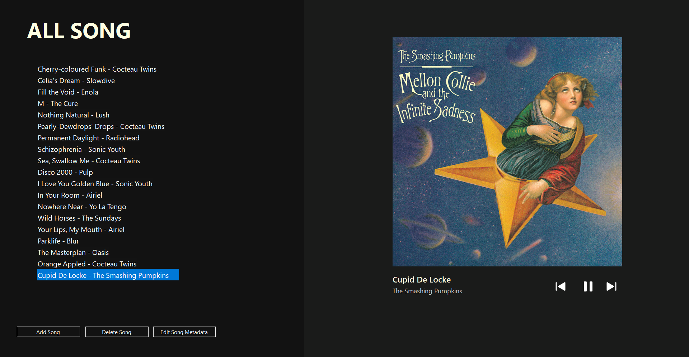

  <h1>SonicFlow</h1>
  

  

SonicFlow is a lightweight music player application developed in C# using Windows Forms. Leveraging the NAudio library for audio playback and TagLib# for metadata extraction, the application provides a minimalistic yet functional interface for users to manage and play their music tracks. The lightweight design ensures simplicity and efficiency, offering features such as play, pause, stop, next, and previous song functionalities.

  <h2>#Libraries</h2>
  <ul>
    <li>NAudio
NAudio is a .NET audio library that allows for audio playback, recording, and manipulation.
</li>
    <li>TagLib
TagLib is a library for reading and editing the metadata of several popular audio formats.
</li>
  </ul>

